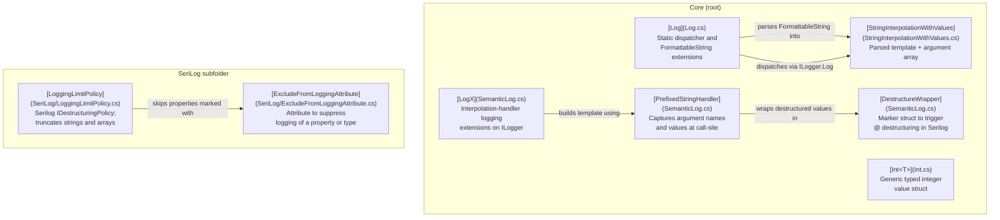

---
digest:
  local-classes:
    DestructureWrapper:
      mtime: "2026-06-11T12:18:53Z"
      digest: "e3b0c44298fc1c149afbf4c8996fb92427ae41e4649b934ca495991b7852b855"
    Int:
      mtime: "2026-06-14T00:58:56Z"
      digest: "0a4ac7c3a97e22765b8ee28ee4baa9c8a3dac777bcfb9574fda918bf9657883c"
    IsExternalInit:
      mtime: "2026-05-19T14:24:41Z"
      digest: "e3b0c44298fc1c149afbf4c8996fb92427ae41e4649b934ca495991b7852b855"
    Log:
      mtime: "2026-06-11T19:12:48Z"
      digest: "6057a5f6267fac2c8bb19fd096a5f717c61697110f525f648c9f1a3b4c49f058"
    LogX:
      mtime: "2026-06-11T12:18:53Z"
      digest: "390c7304721fa0c125175bc6a7b15ad5cbe02c1ea2a2a2dfccefd2ccd9c5bc43"
    PrefixedStringHandler:
      mtime: "2026-06-11T12:18:53Z"
      digest: "edb317fd6897187b61d4e0159cd1d664ea1690dd7a7fc2eb08788f9f746d5cd5"
    Program:
      mtime: "2026-06-14T06:07:55Z"
      digest: "8b4e2159ade04ce1383da2aa2e0f47c259eebbe4f7a5d9546c89356042e5e6f4"
    StringInterpolationWithValues:
      mtime: "2026-06-11T12:18:53Z"
      digest: "11eb3dd0720f3c59206440050317d00db09a2a43ca7f287c9412d09053d209b9"
  folders: {}
---
# SpocWeb.Logging


SpocWeb.Logging is a minimal, injection-free logging utility
that bridges C# string interpolation with structured logging
via `Microsoft.Extensions.Logging` and Serilog.
It eliminates the need to inject `ILogger` everywhere
by exposing a single static `Log.Logger` dispatcher,
while preserving semantic property names using
`CallerArgumentExpression` and `CallerFilePath`.
The library can optionally be combined with the SpocWeb.Proxies project,
which provides a dynamic logging proxy interceptor
pluggable via Dependency Injection to log all calls
with their parameters and return values.

## Architecture



## Entry Points

- [Log.Error(FormattableString)](Log.cs#L59) — log an error from a string interpolation expression, capturing source location automatically.
- [Log.Information(FormattableString)](Log.cs#L103) — log at information level; representative of all six severity-level overloads.
- [Log.Parse(FormattableString)](Log.cs#L293) — parse and cache a `FormattableString` into a `StringInterpolationWithValues`, reading expression names from the call-site source.
- [LogX.Logg(ILogger, PrefixedStringHandler)](SemanticLog.cs#L178) — log a semantically named interpolated string directly on an `ILogger`, with compile-time level gating.
- [LoggingLimitPolicy.TryDestructure](SeriLog/LoggingLimitPolicy.cs#L42) — Serilog destructuring policy entry point; truncates strings, limits arrays, and filters excluded properties.

## Quick Start

### 1. Assign the global logger once at startup

```csharp
using org.SpocWeb.root.logging;

Log.Logger = loggerFactory.CreateLogger("App");
```

### 2. Log with a `FormattableString` — no injection required

```csharp
Log.Information($"Processing order {orderId} for customer {customerName}");
Log.Error($"Failed to save {entity}", exception);
```

The library resolves argument names from the call-site source file
via `CallerArgumentExpression` (NET 6+) or by reading the source line on older targets,
so the Serilog / OTel JSON output contains named properties rather than positional indices.

### 3. Semantic logging on an injected `ILogger`

```csharp
logger.Logg($"User {userId} logged in from {ipAddress}");
```

`PrefixedStringHandler` is resolved at compile time;
the interpolation is skipped entirely when the log level is disabled.

### 4. Control destructuring

```csharp
logger.Logg($"Payload: {payload.Destructure()}");
```

The `@` prefix is injected into the template automatically,
instructing Serilog / OTel providers to serialize the object as a structure.

## Key Concepts

### `StringInterpolationWithValues`

Captures the parsed `MessageTemplate` alongside the raw argument array.
Returned by every `Log.*` method so call-sites can reuse the message
(e.g. as an exception message) without re-parsing.
See [StringInterpolationWithValues.cs](StringInterpolationWithValues.cs).

### `PrefixedStringHandler` / `LogX`

Uses the `[InterpolatedStringHandler]` pattern so the compiler passes
each interpolated segment directly into the handler,
enabling compile-time level gating (`out isEnabled`)
and semantic key capture via `CallerArgumentExpression`.
See [SemanticLog.cs](SemanticLog.cs).

### `LoggingLimitPolicy`

A Serilog `IDestructuringPolicy` that limits string length
(default 100 chars) and array cardinality (default 10 elements),
and omits properties annotated with `[ExcludeFromLogging]`
or listed in `IgnoredProperties`.
See [SeriLog/LoggingLimitPolicy.cs](SeriLog/LoggingLimitPolicy.cs).

### `Int<T>`

A generic, strongly typed `int` wrapper that prevents mixing up
domain-specific integer identifiers (e.g. `Int<OrderId>` vs `Int<CustomerId>`).
Supports arithmetic and comparison operators.
See [Int.cs](Int.cs).

## Further Reading

- [Microsoft.Extensions.Logging abstractions](https://learn.microsoft.com/dotnet/core/extensions/logging)
- [Serilog message templates](https://messagetemplates.org/)
- [InterpolatedStringHandler pattern (C# 10)](https://learn.microsoft.com/dotnet/csharp/advanced-topics/performance/interpolated-string-handler)
- [CallerArgumentExpression attribute](https://learn.microsoft.com/dotnet/csharp/language-reference/attributes/caller-information#callerargumentexpression-attribute)
- SpocWeb.Proxies — dynamic logging proxy interceptor (sibling project)

## Classes

| Class | Responsibility |
|---|---|
| [Int](Int.cs) | Generically typed Int32 |
| [IsExternalInit](IsExternalInit.cs) | Needed for Primary Constructor |
| [Log](Log.cs) | Extension Methods to use StringInterpolationWithValues for Logging. |
| [Program](Program.cs) | Entry point placeholder for the SpocWeb. |
| [PrefixedStringHandler](SemanticLog.cs) | Interpolation Handler to capture the Expression in the Interpolation String |
| [DestructureWrapper](SemanticLog.cs) | Makes the compiler pick a different overload of the AppendFormatted Method. |
| [LogX](SemanticLog.cs) | Extension Methods to log semantically with String Interpolation. |
| [StringInterpolationWithValues](StringInterpolationWithValues.cs) | Encapsulates a parsed StringInterpolation with values |

## Subsystems

| Folder | Domain Role |
|---|---|
| [`SeriLog/`](SeriLog/ReadMe.md) | Serilog-specific extensions for `SpocWeb.Logging`: a destructuring policy that truncates oversized strings and arrays, and an attribute that suppresses logging of sensitive or irrelevant properties. |
