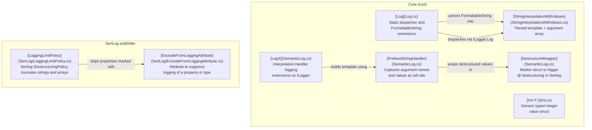

# SpocWeb.Logging

<!-- digest-map
local-classes:
  DestructureWrapper: mtime=2026-03-11T07:58:58Z digest=de2eed1a9afb2c8a854e1053da6599131b07349921066987ca2a94faabcf6369
  ExcludeFromLoggingAttribute: mtime=2025-05-02T17:50:18Z digest=a0abcb7a602f933d81f71ef7fcb71b7e0559850e350427f6839c82827a93ffe8
  Int: mtime=2026-03-06T12:14:31Z digest=e7a003742c58af98acdca4f9428a9f0bc6558f0323f808fa56cee8cc2ff4dbe9
  IsExternalInit: mtime=2024-10-07T13:17:24Z digest=1c92ff0e1cf64aef6c485bdffc89ea343bbd6bbe9cefd939e21ababdd082d938
  Log: mtime=2026-03-06T12:13:23Z digest=afae3f6b5902d3e5547e169262035596db690e64ea00858288dd6d86ca7b3a82
  LoggingLimitPolicy: mtime=2026-03-06T09:42:35Z digest=b74a830f176cf637f66813edf9dcea72b6d085643d39dda456cb3cfc43c8bf0f
  LogX: mtime=2026-03-11T07:58:58Z digest=de2eed1a9afb2c8a854e1053da6599131b07349921066987ca2a94faabcf6369
  PrefixedStringHandler: mtime=2026-03-11T07:58:58Z digest=de2eed1a9afb2c8a854e1053da6599131b07349921066987ca2a94faabcf6369
  Program: mtime=2025-05-02T17:50:18Z digest=e3b0c44298fc1c149afbf4c8996fb92427ae41e4649b934ca495991b7852b855
  StringInterpolationWithValues: mtime=2025-05-02T17:50:18Z digest=ab10d5f9a9a2bee8442630c682e99e51eae2a70c7cbabda62b8197577a1dac78
folders:
folder_digest: aecf509e95598af9df6d0f3cf8206c279636bd967083533aa63f830c442122c4
folder_mtime: 2026-03-11T07:58:58Z
-->

SpocWeb.Logging is a minimal, injection-free logging utility
that bridges C# string interpolation with structured logging
via `Microsoft.Extensions.Logging` and Serilog.
It eliminates the need to inject `ILogger` everywhere
by exposing a single static `Log.Logger` dispatcher,
while preserving semantic property names using
`CallerArgumentExpression` and `CallerFilePath`.
The library can optionally be combined with the SpocWeb.Proxies project,
which provides a dynamic logging proxy interceptor
pluggable via Dependency Injection to log all calls
with their parameters and return values.

## Architecture



## Entry Points

- [Log.Error(FormattableString)](Log.cs#L59) — log an error from a string interpolation expression, capturing source location automatically.
- [Log.Information(FormattableString)](Log.cs#L103) — log at information level; representative of all six severity-level overloads.
- [Log.Parse(FormattableString)](Log.cs#L293) — parse and cache a `FormattableString` into a `StringInterpolationWithValues`, reading expression names from the call-site source.
- [LogX.Logg(ILogger, PrefixedStringHandler)](SemanticLog.cs#L178) — log a semantically named interpolated string directly on an `ILogger`, with compile-time level gating.
- [LoggingLimitPolicy.TryDestructure](SeriLog/LoggingLimitPolicy.cs#L42) — Serilog destructuring policy entry point; truncates strings, limits arrays, and filters excluded properties.

## Quick Start

### 1. Assign the global logger once at startup

```csharp
using org.SpocWeb.root.logging;

Log.Logger = loggerFactory.CreateLogger("App");
```

### 2. Log with a `FormattableString` — no injection required

```csharp
Log.Information($"Processing order {orderId} for customer {customerName}");
Log.Error($"Failed to save {entity}", exception);
```

The library resolves argument names from the call-site source file
via `CallerArgumentExpression` (NET 6+) or by reading the source line on older targets,
so the Serilog / OTel JSON output contains named properties rather than positional indices.

### 3. Semantic logging on an injected `ILogger`

```csharp
logger.Logg($"User {userId} logged in from {ipAddress}");
```

`PrefixedStringHandler` is resolved at compile time;
the interpolation is skipped entirely when the log level is disabled.

### 4. Control destructuring

```csharp
logger.Logg($"Payload: {payload.Destructure()}");
```

The `@` prefix is injected into the template automatically,
instructing Serilog / OTel providers to serialize the object as a structure.

## Key Concepts

### `StringInterpolationWithValues`

Captures the parsed `MessageTemplate` alongside the raw argument array.
Returned by every `Log.*` method so call-sites can reuse the message
(e.g. as an exception message) without re-parsing.
See [StringInterpolationWithValues.cs](StringInterpolationWithValues.cs).

### `PrefixedStringHandler` / `LogX`

Uses the `[InterpolatedStringHandler]` pattern so the compiler passes
each interpolated segment directly into the handler,
enabling compile-time level gating (`out isEnabled`)
and semantic key capture via `CallerArgumentExpression`.
See [SemanticLog.cs](SemanticLog.cs).

### `LoggingLimitPolicy`

A Serilog `IDestructuringPolicy` that limits string length
(default 100 chars) and array cardinality (default 10 elements),
and omits properties annotated with `[ExcludeFromLogging]`
or listed in `IgnoredProperties`.
See [SeriLog/LoggingLimitPolicy.cs](SeriLog/LoggingLimitPolicy.cs).

### `Int<T>`

A generic, strongly typed `int` wrapper that prevents mixing up
domain-specific integer identifiers (e.g. `Int<OrderId>` vs `Int<CustomerId>`).
Supports arithmetic and comparison operators.
See [Int.cs](Int.cs).

## Further Reading

- [Microsoft.Extensions.Logging abstractions](https://learn.microsoft.com/dotnet/core/extensions/logging)
- [Serilog message templates](https://messagetemplates.org/)
- [InterpolatedStringHandler pattern (C# 10)](https://learn.microsoft.com/dotnet/csharp/advanced-topics/performance/interpolated-string-handler)
- [CallerArgumentExpression attribute](https://learn.microsoft.com/dotnet/csharp/language-reference/attributes/caller-information#callerargumentexpression-attribute)
- SpocWeb.Proxies — dynamic logging proxy interceptor (sibling project)
